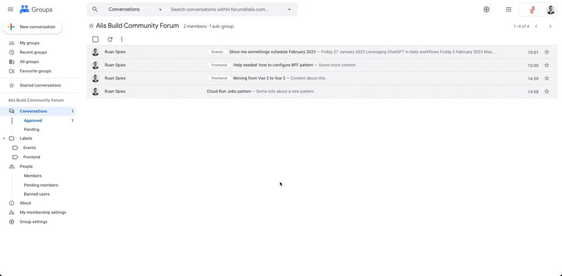
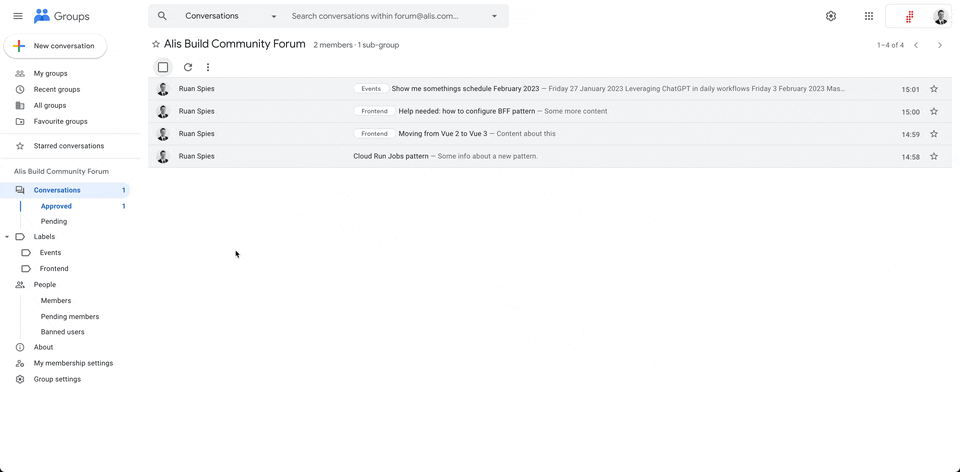

# Alis Build Community Forum Preferences

The purpose of this page is to give guidance in using the Alis Build Community Forum.

## View specific topics

We have created some labels to categorise the different topics that emerge in the forum.
Use the labels as shown below to easily find topics of relevance.

## Subscription preferences

You can set a global subscription preference which determines the frequency and type of
emails received from the forum.

The following [types of subscriptions](https://support.google.com/groups/answer/9792489?hl=en#) are available:
- **Each email** — Messages are sent individually as they’re posted to the group.
- **Digest** — Up to 25 complete messages are combined into single emails and sent daily.
- **Abridged** — Summaries of up to 150 messages are combined into single emails and sent daily.
- **No email** — Messages from the group are not sent.

## Subscribe to individual conversations

If you do not want to receive all emails, you can still subscribe to specific conversations, as shown below,
to receive emails with any messages sent in the conversation.

