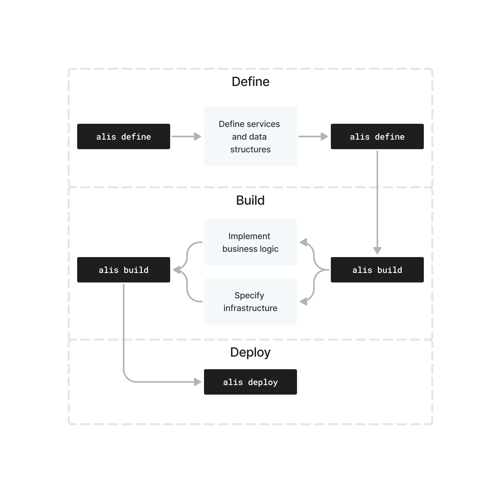

# Overview

The Alis Build platform enables individuals and organisations to move from simply writing code to building enterprise-grade software.
In this section we consider what the developer experience is like for the simple steps of _define_, _build_ and _deploy_.
The high-level overview is depicted below.

A product on the platform is what is offered to the world and consists of one or more underlying services which provide the functionality of the product.

In this overview, it is the building of these underlying services which we are interested in. The high-level process that is followed
when creating services is depicted below.



Each of the steps is explained in the following sections and follow the structure:<br>
- Overview of the step; <br>
- 👨‍💻 **User actions** - the actions that are required from the user; and<br>
- 🏗 **Alis Build** - what is facilitated by us in the background<br>

> ‼️ The build example provides detailed steps for the user actions whereas this section aims to communicate the high-level overview of what would be done.

:::warning
All the CLI commands referenced on this page requires [Alis Build Enterprise](https://alisx.com/#:~:text=Enterprise), which gives the simple process
of define, implement and consume superpowers by providing a complete cloud development framework for teams and organisations.
:::


## Define: Run the `alis define` command (initial)

Defining things properly is the cornerstone of what we build on the platform. We make use of
[Protocol Buffers](../references/core-technologies.md) to define everything that we do (`services` and `methods`)
and interact with (_data structures_ specified as `messages`).

#### 👨‍💻 User actions

Simply run the `alis define` command from the terminal.

#### 🏗 Alis Build

The first time the command is run for a specified service, the platform provides a boilerplate protocol buffer file,
which is to be populated in the following, and formally registers this on the platform.

## Define: Methods and messages

Defining the services and data structures is one of the most important aspects of the
process as it serves as the universal source of truth for the functionality of that which you build.
These definitions are used to make it simple to both implement your business logic and make it simple
for others to use.

The [Resource-oriented design](../references/resource-oriented-design.md) pattern provides detailed guidelines
on how to approach the definitions and best practices for writing APIs.

#### 👨‍💻 User actions

The user is required to flesh out the definitions in the protocol buffer file, which should be consistent with [Google's API Improvement Proposals](https://google.aip.dev/1).
Various tooling, such as linters, exists to aid this process.

The primary questions that developers aim to answer during this step is:

1. **What is the overarching service concerned with?**<br>
This will be specified as the `service` name.<br>
2. **What operations are to be performed as part of this service?**<br>
These will be translated into the `rpc` methods in the proto file, housed in the former mentioned `service`.<br>
3. **What are the data structures required as part of the service?**<br>
These will be translated into the `messages` in the proto file.<br>
4. **What are the potential relationships and hierarchy between the resources?**<br>
These will be modelled in the relevant `messages` where applicable

Below are some examples of answering these questions

<tabs>
<tab name="Forecasting">

#### Questions
1. **What is the overarching service concerned with?**<br>
   Various forecasts associated with physical assets. Therefore, `Forecast` service.
2. **What operations are to be performed as part of this service?**<br>
   At this stage, we will only be forecasting depreciation on assets. Therefore, a `ForecastDepreciation` method.
3. **What are the data structures required as part of the service?**<br> T
   We are only concerned with the request and response messages for the method.<br><br> The request will require the initial cost of the asset, it's salvage value, the number of months over which it will be depreciated and the forecast period.<br>The response will simply contain the forecasted depreciation amount.
4. **What are the potential relationships and hierarchy between the resources?**<br>
   Not relevant<br>

#### Resulting proto

```protobuf
// Forecast services manages forecasts around assets
service Forecast {
	// Forecast depreciation for an asset
	// given a set of factors
	rpc ForecastDepreciation(ForecastDepreciationRequest) returns (ForecastDepreciationResponse) {}
}

// Request message for forecasting depreciation
message ForecastDepreciationRequest {
	// The initial cost of the asset.
	string initial_cost = 1;
	// The salvage value of the asset.
	float salvage = 2;
	// The total number of periods (in months) over which
	// the asset will be depreciated
	int32 life_months = 3;
	// Forecast period is for depreciation (in months)
	int32 forecast_period = 4;
}

// Request message for forecasting depreciation
message ForecastDepreciationResponse {
	// The forecasted depreciation for the
	// given period.
	float depreciation = 1;
}
```

</tab>

[//]: # (<tab name="Calculations">)

[//]: # (### Answering the questions)

[//]: # (1. **What is the overarching service concerned with?**<br>)

[//]: # (This will be specified as the `service` name.<br>)

[//]: # (2. **What operations are to be performed as part of this service?**<br>)

[//]: # (These will be translated into the `rpc` methods in the proto file, housed in the former mentioned `service`.<br>)

[//]: # (3. **What are the data structures required as part of the service?**<br> T)

[//]: # (These will be translated into the `messages` in the proto file.<br>)

[//]: # (</tab>)

[//]: # (<tab name="Portfolios">)

[//]: # (...)

[//]: # (</tab>)

[//]: # (<tab name="Books">)

[//]: # (...)

[//]: # (</tab>)
</tabs>

Since the protos sit within a version control repo, multiple developers may collaborate and iterate on the proto design. Once the proto is defined and ready to be implemented, the `alis define` command can be run again.

## Define: Run the `alis define` command

Running the `alis define` command after a definition has been added communicates that the current state of the proto is the source of truth.
In other words, it is what should be implemented on your side and what clients can expect to consume. There is a lot that also happens in the background which we will unpack in the following section.

#### 👨‍💻 User actions
Simply run the `alis define` command from the terminal.

#### 🏗 Alis Build
The command automatically kicks off a lot of processes on the Alis Build platform, which include:

- Auto-generating internal and client facing client libraries for a range of supported languages (currently Go, Python and JavaScript). This allows for easy implementation of the methods and allows clients to easily consume your services in their own development environment.
- Autoconfiguring API gateways for the services specified in the proto files. This provides HTTP endpoints for the gRPC methods, allowing for traditional REST calls to be made to the endpoints.
- [Auto-generating documentation](../how-to-guides/auto-generated-docs) for your product directly from your proto definitions.

This single source of truth also sets the foundation for additional auto-generated aspects, which are discussed in the following sections.

## Build: Run the `alis build` command

Now that the definitions are formally in place, the _building_ of the infrastructure and code that executes the logic.

The cloud infrastructure is specified using Terraform and the code implementation may be done in any language.

#### 👨‍💻 User actions

Simply run the `alis build` command from the terminal and follow the prompts.

#### 🏗 Alis Build

The first time that the `alis build` command is run, in the background it will register a new build implementation and will provide:
1. Code scaffolding which use a templating engine along with the latest definitions to auto-generate server implementation code in the supported languages; and
2. Pre-populated infrastructure specification files (Terraform files).

## Build: Implement business logic

In the majority of cases, building requires some form of code implementation,

In this step, one effectively builds out the services to process the request, execute logic in the code and return a response.

#### 👨‍💻 User actions

1. Using either the auto-generated template files or your own custom files, implement the business logic as per the definition files by using the auto-generated client libraries.
2. If necessary, customise the `Dockerfile` to ensure that the containerisation of the code will be correct.

## Build: Specify infrastructure

The Terraform files define the cloud infrastructure requirements for the service to work.

#### 👨‍💻 User actions

After the first execution of the `alis build`, an initial set of Terraform files are added. These can either be customised or additional specifications added based on the needs of your implementation. The [documentation on the Terraform site](https://registry.terraform.io/providers/hashicorp/google/latest/docs) serves as an excellent reference for this.

## Build: Run the `alis build` command

Running the `alis build` command at any time following the initial run will result in two primary things:
1. The implemented business logic is containerised and the resulting image is saved in the Cloud.
2. The latest commit of the infrastructure specification is tagged such that it can be easily deployed in the following step.

#### 👨‍💻 User actions

Simply run the `alis build` command from the terminal.

#### 🏗 Alis Build

Alis Build looks for one or more Dockerfile in the relevant services directory where the implementation lives. These Dockerfiles are built on [Cloud Build](https://cloud.google.com/build) and the resulting images are stored on Artifact Registry.
Furthermore, the tagging of the infrastructure that is required on `deploy` is facilitated by us.

## Deploy: Run the `alis deploy` command

In this step, the business logic is deployed to a specific environment(s) (e.g. development or production) by applying the formerly specified infrastructure.

A typical example of the outcome would be that a deployment environment has:
- A deployed and fully managed instance of the business logic (on e.g. a [Cloud Run](https://cloud.google.com/run) instance) which provides clients a means of accessing the service.
- A [Cloud BigTable NoSQL database](https://cloud.google.com/bigtable), or other form of storage, which stores information.

#### 👨‍💻 User actions

Simply run the `alis deploy` command from the terminal and follow the prompts.

#### 🏗 Alis Build

Using the tag that was added when running the `alis build` command, the infrastructure specification is applied in the deployment environment specified.

With the former example, this would result in:
- Creating a new Cloud Run instance that uses the image created during the `build` step; and
- Creating a new BigTable table with the specified table design.

Leveraging the infrastructure specification as code (using Terraform) allows builders to only care about correctly defining the specification, the Alis Build platform will facilitate the implementation thereof.

## See it for yourself

[//]: # (You can see the basic flow in the sample: [Effortlessly Deploy your Insurance Pricing model developed in Python at scale]&#40;https://samples.alis.build/samples/1666818220001&#41;.)

We are advocates of learning by doing and are currently working on a comprehensive build example. In the meantime, [schedule a demo](https://alis.exchange/signup) by filling out the form, and we will take you through the process.

